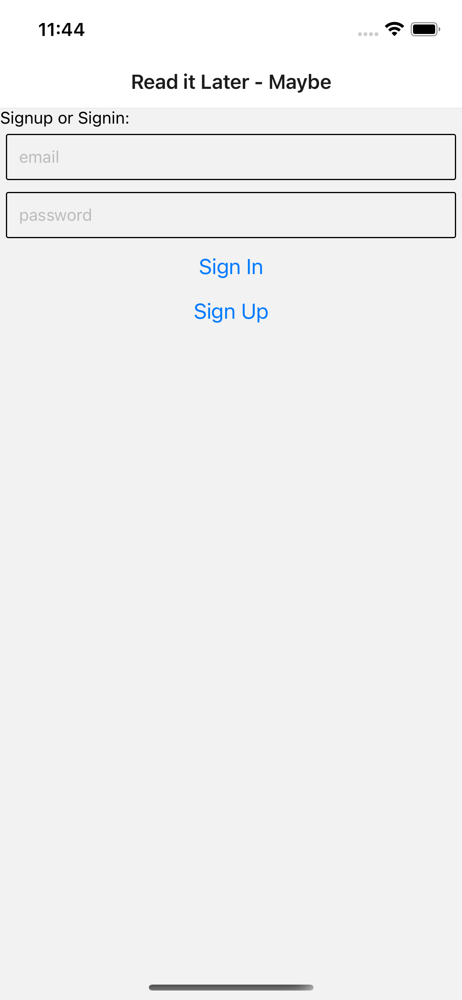
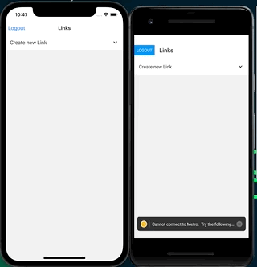
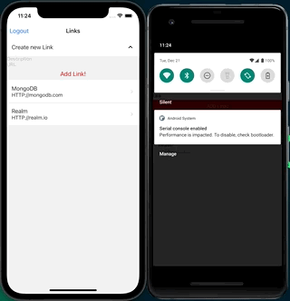

# Read it Later... Maybe

A small “read it later” kind of app to store links we save for later reading. As sometimes we never get back to those links I’ll call it Read It Later - _Maybe_. 

|    Login   |  Adding a Link    |      
| :-------------: | :----------: | 
|   |    | 

|    All Links   |  Deleting a Link    |      
| :-------------: | :----------: | 
|   |    | 

And as we're using Realm Sync, every change is synced on all devices.

But wait, this also works offline!

## How all this works

This is a React Native app made with Expo + Realm. All details in this [MongoDB Realm DevHub Tutorial](https://www.mongodb.com/developer/how-to/build-offline-first-react-native-mobile-app-with-expo-and-realm)

## Can I use it now?

Sure! You need to:
- [create a Free MongoDB Atlas account](https://account.mongodb.com/)
- [create a Free M0 tier cluster](https://docs.atlas.mongodb.com/tutorial/create-new-cluster/)
- [set up a Realm App](https://docs.mongodb.com/realm/manage-apps/create/create-with-realm-ui/)
- copy the Realm App ID and set it in `RealmApp.js`
- [Install Expo Cli](https://docs.expo.dev/workflow/expo-cli/)
- `git clone https://github.com/mongodb-developer/read-it-later-maybe`
- `cd read-it-later-maybe`
- `expo run:ios` or `expo run:android`

## Resources

To learn more about Realm/MongoDB you have all these fantastic resources:

- [💻 MongoDB DeveloperHub, central point for everything MongoDB/Realm related](https://www.mongodb.com/developer)
- [💬 The MongoDB Forums](https://www.mongodb.com/community/forums/)
- [👩‍💻 Developer Blog](https://developer.mongodb.com/learn/?content=Articles#main)
- [🎓 MongoDB University](https://university.mongodb.com/)
- [📺 Youtube Channel](https://www.youtube.com/c/MongoDBofficial)
- [🎧 The MongoDB Podcast](https://developer.mongodb.com/learn/?content=Podcasts#main)
- [🎧 Unicode U00D1 (in Spanish 🇪🇸) Podcast](https://twitter.com/UnicodeU00D1)
